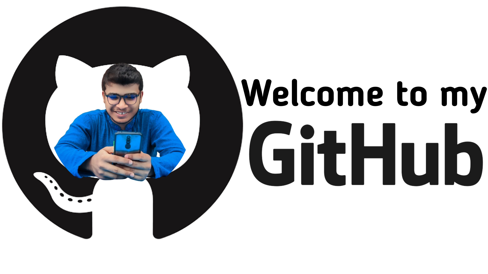

<h1 align="center">HiI am Md Sadiul Haque </h1>

🚀 **CFO at [ShushilLife.com](https://shushillife.com)**  
💼 **Data Science Expert** | 🎓 **BSc in CSE @Dhaka International University**  

<b>Visitor's Count</b>

 

### 🧠 What I Do
- Build interactive dashboards & business reports 📊
- Explore Machine Learning & AI applications 🤖
- Analyze data for smart decision-making 📈
- Lead startup finance & product vision 💡

### 🛠️ Tech Stack

### 📌 Featured Projects
- 🏅 **Olympic Medals Dashboard** – Power BI
- 🧠 **Customer Segmentation with Clustering** – Python
- 📈 **Business KPI Dashboard** – Power BI

> 🔗 More on [GitHub Projects](https://github.com/mdsadiulhaque?tab=repositories)

### 🌐 Connect with Me

  🚀 _Turning Data Into Insights — and Ideas Into Impact._

<!-- Last updated: June 2025 -->
